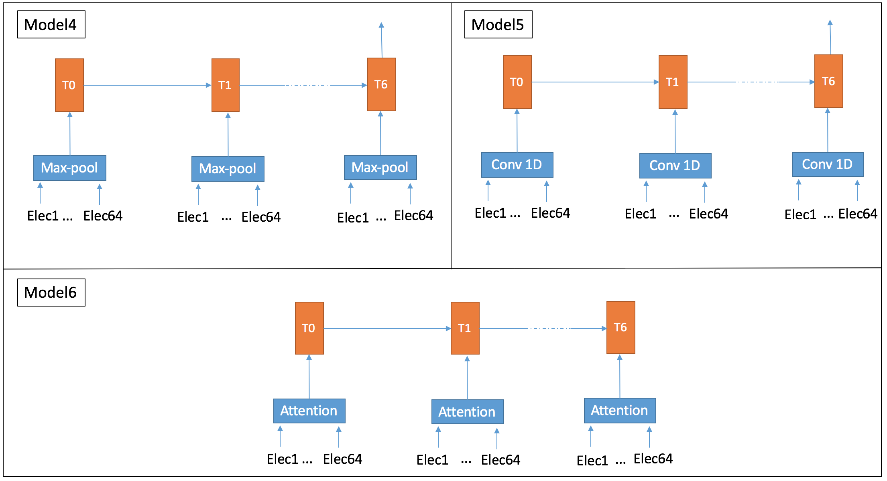

# DeepEEG

this code has been developed within the scope of the final project of the class ["CS 598 LAZ: Cutting-Edge Trends in Deep Learning and Recognition"](http://slazebni.cs.illinois.edu/spring17/) (Spring 2017) at the University of Illinois at Urbana-Champaign.

**Project Description:** 
The goal of the project is to Classify the memory workload of 13 participants into 4 categories. 
Continuous EEG was recorded from 64 electrodes placed over the scalp of the participants. During the experiment, an array of English characters was shown for 0.5 second (SET) and 13 participants were instructed to memorize the characters. A TEST character was shown three seconds later and participants indicated whether the test character was among the first array (’SET’) or not by press of a button. The number of characters in the SET for each trial was randomly chosen to be 2, 4, 6, or 8. We identify each of the conditions containing 2, 4, 6, 8 characters with loads 1-4 respectively. Recorded brain activity during the period which individuals retained the information in their memory (3.5 seconds) was used to recognize the amount of mental workload. In total, the dataset consists of 2670 trials. For more details about the experiment and the data, check [(Bashivan et al. (2016))](https://arxiv.org/abs/1511.06448).

**Architectures:** 
We implemented 7 architectures to classify the memory worload

**Requirements:**
The following packages are required to run the code:
* Tensorflow 1.0 or greater
* Python3

