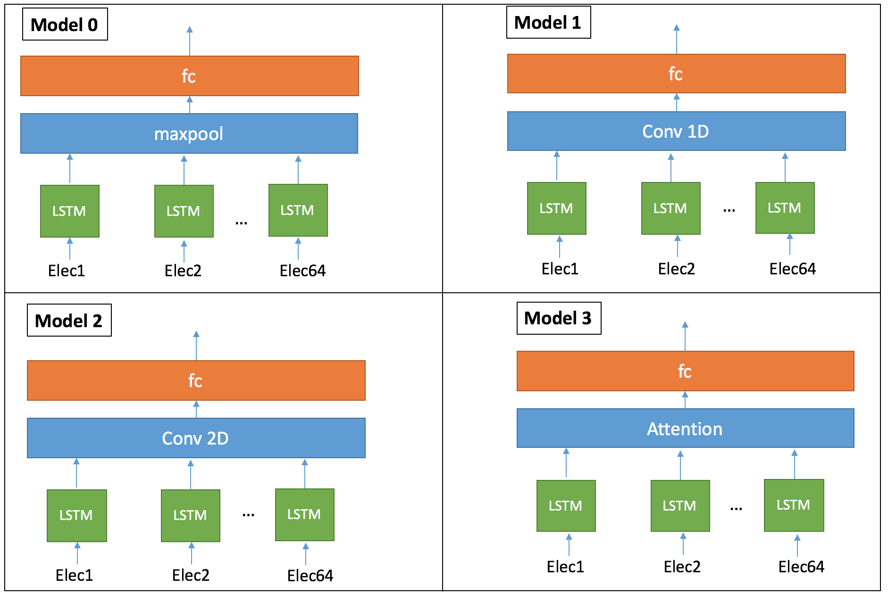
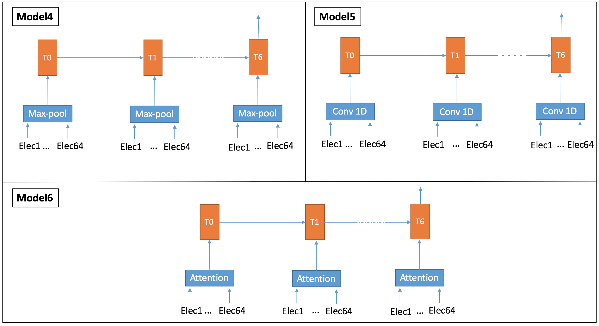

# DeepEEG

this code has been developed within the scope of the final project of the class ["CS 598 LAZ: Cutting-Edge Trends in Deep Learning and Recognition"](http://slazebni.cs.illinois.edu/spring17/) (Spring 2017) at the University of Illinois at Urbana-Champaign.

**Project Description:** 
The goal of the project is to Classify the memory workload of 13 participants into 4 categories. 
Continuous EEG was recorded from 64 electrodes placed over the scalp of the participants. During the experiment, an array of English characters was shown for 0.5 second (SET) and 13 participants were instructed to memorize the characters. A TEST character was shown three seconds later and participants indicated whether the test character was among the first array (’SET’) or not by press of a button. The number of characters in the SET for each trial was randomly chosen to be 2, 4, 6, or 8. We identify each of the conditions containing 2, 4, 6, 8 characters with loads 1-4 respectively. Recorded brain activity during the period which individuals retained the information in their memory (3.5 seconds) was used to recognize the amount of mental workload. In total, the dataset consists of 2670 trials. For more details about the experiment and the data, check [(Bashivan et al. (2016))](https://arxiv.org/abs/1511.06448).

**Architectures:** 
We implemented 7 architectures to classify the memory worload

**Requirements:**
The following packages are required to run the code:
* Tensorflow 1.0 or greater
* Python3

**Prepare the Training Data:**
To train the model you will need to provide training data in native TFRecord format. The TFRecord format consists of a set of sharded files containing serialized tf.SequenceExample protocol buffers. Each tf.SequenceExample proto contains a label and a tensor with the EEG recording. First download the data from [(Bashivan et al. (2016))](https://github.com/pbashivan/EEGLearn/tree/master/Sample%20data). Then, run data/process_inputs.sh. This will generate a folder with a TFRecord for every participant.

**Training the Model:**
We use leave-subject-out cross validation approach. In each of the 13 folds, all trials belonging to one of the subjects were used as the test set. A number of samples equal to the test set were then randomly extracted from rest of data for validation set and the remaining samples were used as training set. 
First set the path to DeepEEG properly (Lin14). 
Then, run the training script train.sh. Do not forget to specify the patient on which the testing is performed.

**Evaluating and Testing the Model:**
Run the evaluation script evaluate.sh in a separate process. This will log evaluation metrics to TensorBoard which allows training progress to be monitored in real-time. You can use the same script to evaluate the model on thetest data. Make sure you set the path to the testing folder properly.

**Tensorboard:**
Run a TensorBoard server in a separate process for real-time monitoring of training progress and evaluation metrics. 
Once TensorBoard is running, navigate your web browser (preferably google chrome) to localhost:6006 to view the TensorBoard.
